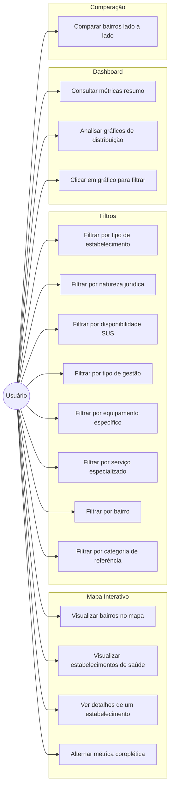
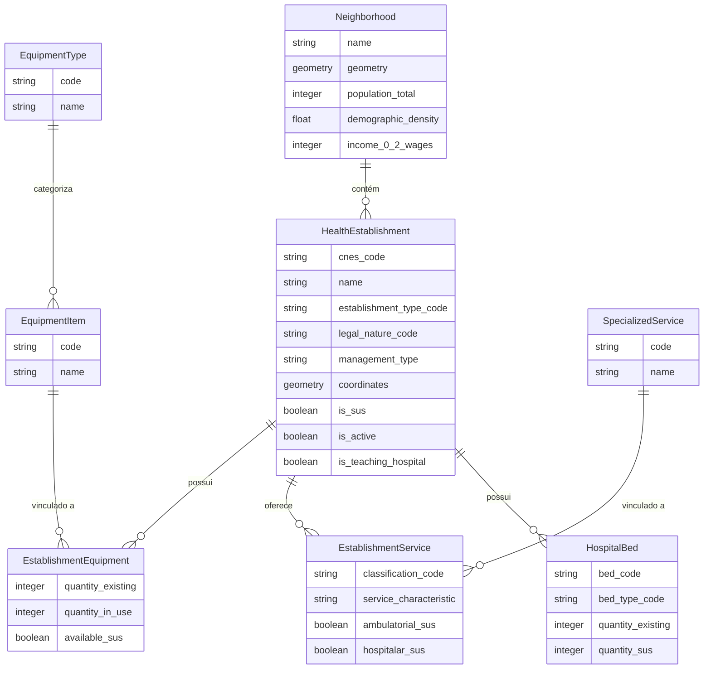
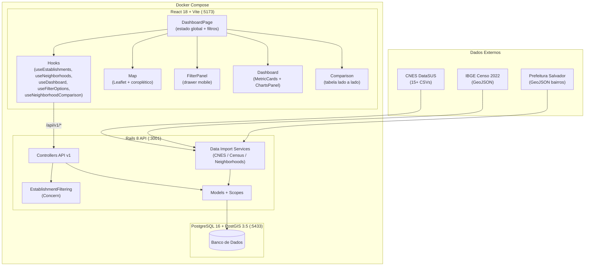

# Dashboard Interativo de Acesso à Saúde em Salvador

Dashboard com mapa interativo para visualização e análise da distribuição de equipamentos, estabelecimentos e serviços de saúde pública em Salvador, Bahia. O sistema cruza dados do CNES (Cadastro Nacional de Estabelecimentos de Saúde), Censo IBGE e GeoJSON de bairros para oferecer uma visão espacial do acesso à saúde no município.

---

## Diagramas

### Casos de Uso



### Modelo de Dados (ER)



### Arquitetura do Sistema



---

## Stack

| Camada | Tecnologia |
|--------|-----------|
| Backend | Ruby on Rails 8 (API-only) |
| Banco de dados | PostgreSQL 16 + PostGIS 3.5 |
| Frontend | React 18 + Vite + TypeScript |
| Mapa | Leaflet 1.9 + react-leaflet 4 |
| Estilização | Tailwind CSS 3 |
| Infraestrutura | Docker Compose |

---

## Pré-requisitos

- Docker e Docker Compose

---

## Configuração e execução

```bash
# Subir todos os serviços (banco + API + frontend)
docker compose up

# API:       http://localhost:3001
# Dashboard: http://localhost:5173
```

### Primeira execução — importar dados

```bash
# Cria e migra o banco
make create_db
make migrate

# Importa dados do CNES, bairros e censo
docker compose exec web bundle exec rails data:import:all
```

### Rodar o frontend sem Docker

```bash
cd frontend
npm install
npm run dev
# http://localhost:5173 (requer API rodando em :3001)
```

### Rodar os testes

```bash
# Backend (RSpec) — dentro do container
docker compose exec web bundle exec rspec

# Seeds spec isolado
docker compose exec web bundle exec rspec spec/db/seeds_spec.rb

# Frontend (Vitest)
docker compose run --rm --no-deps frontend sh -c "npm install && npm test"

# Frontend em modo watch (sem Docker)
cd frontend && npm run test:watch
```

---

## Comandos úteis (Makefile)

```bash
make bash        # Shell no container da aplicação
make console     # Rails console
make routes      # Lista todas as rotas
make migrate     # Executa migrations pendentes
make rollback    # Desfaz a última migration
make seed        # Executa db/seeds.rb (importa todos os dados)
make drop        # Dropa o banco
make create_db   # Cria o banco
```

---

## API Endpoints

### Bairros
```
GET /api/v1/neighborhoods
  Retorna GeoJSON (FeatureCollection) com bairros e dados demográficos

GET /api/v1/neighborhoods/:id
  Detalhes de um bairro, incluindo contagem de equipamentos
```

### Estabelecimentos de Saúde
```
GET /api/v1/health_establishments
  Retorna GeoJSON (FeatureCollection) com filtros opcionais:
    ?type=<código_tipo>
    ?legal_nature=publica|privada|sem_fins_lucrativos|pessoa_fisica
    ?management=M|E|D|S
    ?sus_only=true
    ?neighborhood_id=<id>
    ?service=<código_serviço>
    ?equipment=<código_equipamento>

GET /api/v1/health_establishments/:id
  Detalhes completos: equipamentos, serviços especializados e leitos
```

### Filtros
```
GET /api/v1/filter_options
  Opções disponíveis para os filtros do painel:
    { establishment_types, legal_natures, management_types }
  Sempre retorna todos os valores independente do banco de dados.
```

### Dashboard
```
GET /api/v1/dashboard/overview
  Totais gerais: estabelecimentos, equipamentos, leitos SUS, bairros

GET /api/v1/dashboard/equipment_by_neighborhood
  Total de equipamentos por bairro (ordenado por volume)

GET /api/v1/dashboard/service_summary
  Top 20 serviços especializados por número de estabelecimentos
```

---

## Fontes de Dados

| Fonte | Dados |
|-------|-------|
| CNES (DataSUS, agosto/2025) | Estabelecimentos, equipamentos, serviços e leitos. `is_active` é derivado de `CO_MOTIVO_DESAB` (estabelecimentos desativados são marcados como inativos) |
| IBGE Censo 2022 — `BA_bairros_CD2022.geojson` | Polígonos dos bairros + hierarquia administrativa completa (região → UF → município → distrito → subdistrito) + `area_km2` + população total |
| IBGE Censo 2022 — microdata (`agregados_por_bairros_*.csv`) | Demografia detalhada por bairro: faixas etárias finas (0–4, 5–9, …, 70+) e cor/raça × sexo. Joinada por `CD_BAIRRO` |

---

## Modelagem de Dados

```
Neighborhood            → bairros com geometria (MultiPolygon, SRID 4326) + hierarquia
                          administrativa IBGE (região/UF/município/distrito/subdistrito) +
                          área_km² + demografia detalhada (faixas etárias, cor/raça × sexo)
                          Identidade: neighborhood_ibge_code (CD_BAIRRO)
HealthEstablishment     → estabelecimentos (UBS, USF, hospitais, etc.)
                          is_active derivado de CO_MOTIVO_DESAB
EquipmentType           → categorias de equipamentos médicos
EquipmentItem           → equipamentos individuais (mamógrafo, tomógrafo, etc.)
EstablishmentEquipment  → vínculo equipamento ↔ estabelecimento (quantidades)
SpecializedService      → serviços especializados (cardiologia, oncologia, etc.)
EstablishmentService    → vínculo serviço ↔ estabelecimento
HospitalBed             → leitos hospitalares por estabelecimento
```

---

## Estrutura do Frontend

```
frontend/
├── public/
│   └── images/
│       └── bandeira_de_salvador.png  # Ícone da aba do navegador
└── src/
    ├── types/index.ts              # Interfaces TypeScript + constantes de filtros
    ├── hooks/
    │   ├── useNeighborhoods.ts     # Busca bairros da API
    │   ├── useEstablishments.ts    # Busca estabelecimentos com filtros
    │   └── useFilterOptions.ts     # Busca opções de filtro da API (com fallback hardcoded)
    └── components/
        ├── DashboardPage.tsx       # Layout principal + estado global
        ├── Map/
        │   ├── InteractiveMap.tsx       # MapContainer Leaflet
        │   ├── NeighborhoodLayer.tsx    # Camada coroplética por bairro
        │   ├── EstablishmentMarkers.tsx # Marcadores SVG por tipo
        │   ├── EstablishmentPopup.tsx   # Popup com detalhe (lazy)
        │   └── MapLegend.tsx            # Legenda sobreposta ao mapa
        ├── Filters/
        │   └── FilterPanel.tsx          # Sidebar de filtros
        └── ui/
            ├── FilterSelect.tsx         # Select genérico para filtros
            ├── FilterRadioGroup.tsx     # Radio group genérico para filtros
            └── FilterCheckbox.tsx       # Checkbox genérico para filtros booleanos
```

---

## CI/CD

O workflow do GitHub Actions (`.github/workflows/ci.yml`) executa tudo via Docker Compose:

| Job | O que faz |
|-----|-----------|
| `scan` | Brakeman — análise de segurança Rails |
| `lint` | RuboCop — estilo Ruby |
| `test` | RSpec — testes backend |
| `lint_frontend` | ESLint — estilo TypeScript/React |
| `test_frontend` | Vitest — testes frontend |

---

## Documentação Técnica

- [docs/PRD.md](docs/PRD.md) — Especificação do produto e modelagem de dados
- [docs/phase1-implementation.md](docs/phase1-implementation.md) — Backend: models, migrations, importadores, API, testes
- [docs/phase2-implementation.md](docs/phase2-implementation.md) — Frontend: React/Vite, mapa, filtros, componentes UI, CI, decisões de arquitetura
- [docs/phase3-implementation.md](docs/phase3-implementation.md) — Dashboard completo: cards de métricas, gráficos (recharts), camada coroplética por métrica
- [docs/phase4-implementation.md](docs/phase4-implementation.md) — Refinamentos: hospitais de referência, comparativo entre bairros, responsividade mobile
- [docs/phase5-implementation.md](docs/phase5-implementation.md) — Filtros globais, interatividade nos gráficos, clustering, sidebar collapsível, comparação split
- [docs/phase6-implementation.md](docs/phase6-implementation.md) — IBGE como fonte única: schema migration, NeighborhoodImporter rewrite, IbgeCensusImporter

---

## Variáveis de Ambiente

Configuradas automaticamente pelo `docker-compose.yml` no ambiente de desenvolvimento:

| Variável | Valor padrão |
|----------|-------------|
| `POSTGRES_HOST` | `db` |
| `POSTGRES_PORT` | `5432` |
| `POSTGRES_USERNAME` | `postgres` |
| `POSTGRES_PASSWORD` | `password` |
| `RAILS_ENV` | `development` |
